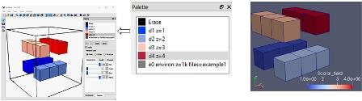
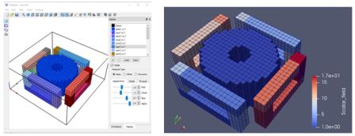

### Motivation
&emsp; _VoxCad_ is a simple 3D editor, but unlike other similar editors, it allows you to enter arbitrary text data about the characteristics of the elements that are included in the 3D image. This circumstance allows you to use _VoxCad_ for visual data entry for various mathematical calculations (for example, calculations of 3D fields or graphical input of large matrices to study storage formats, to study block algorithms, etc.)  
&emsp; _VoxCad_ has its own data format (with the _vxc_ extension), which is small in size due to the use of _zlib_ data compression (it is possible to save data in uncompressed form, but the file size increases).  
&emsp; The goal of this project is to convert the _VoxCad_ format into text data that can be used in mathematical calculations (additionally the data is converted to _vtk_ format for visualization in _ParaView_ )

### Required Software 
- _VoxCad_ for _Windows_ (download: <https://sourceforge.net/projects/voxcad/files/VoxCAD1000-x64.msi/download>)  
&emsp; &emsp; &emsp; or _Linux_ (download: <https://sourceforge.net/projects/voxcad/files/VoxCad0992.tar.gz/download>);   
- _gfortran_ or _ifort_ (versions no lower than Fortran2003);   
- _Python_ (optional) - for data decompression ( I used  _Python_ as part of _Anaconda_, which includes the _zlib_ library for _Python_). 					If the _vxc_ file contains data in uncompressed ASCII format, then there is no need for _Python_. For example, on can use an analogue of _Voxcraft-viz_ with better 3D graphics (<https://github.com/voxcraft/voxcraft-viz>) and which stores data in ASCII by default;  
- _make_ - for assembly;  
- _ParaView_ - to display a file in _vtk_ format (download: <https://www.paraview.org/>);  


### Repository Structure
Directory `/src`:  
-  _vxc2data.f90_  - main program;   
-  _utilites.f90_ - contains routines for working with character strings
  (convert a string to an array of words, convert to upper case,
  converting a word to a number taking into account the prefix (in details:  <https://github.com/JNSresearcher/convert_prefix>);  
-  _write_vtk.f90_ - creating 3D image in _vtk_ format on an unstructured grid;   
-  _uncompress_zlib.py_ - for create a temporary file with converted uncompressed data into ACSII for later processing;  
-  _Makefile_ - creating an executable using _make_.  
- _example1.vxc_ - file for _VoxCad_ with a simple scheme of 4 domains;   
- _motor.vxc_- file for _VoxCad_ with a more complex image.  

### Build  
&emsp; To build the  executable file _vxc2data_, should be configure the _makefile_ first. It is possible to build in _Windows_ or _Linux_, _gfortran_ or _ifort_. To configure, you need to comment/uncomment the top lines, for example, for _Windows_ and _gfortran_:   
```
          OS=win  
        # OS=unix  
          F90=gfortran  
        # F90=ifort
```  
&emsp; Type _make_ at the command prompt and run.  


### Launch of calculation  
&emsp; First, on need to save the data, for example _example1.vxc_, to a working file named _in.vxc_ in the same directory as the _vxc2data_ executable.  
Run the executable: _./vxc2data_ or _vxc2data.exe_. As a result, 2 output files will be created: with extensions _txt_ and _vtk_.

### Example of preparing a source file in VoxCad
&emsp; Example of a simple file (_example1.vxc_) with the dimensions of the working area **5 х 5 х 5**. On the left is an image of the file _example1.vxc_ in _VoxCad_, on the right is an image in _ParaVew_ of the generated file _example1.vtk_.  
       
   
  

&emsp; First, in _VoxCad_ the 4  domains were entered, then a line with additional data.  
&emsp; Text entered for domains:
```
        d1 z=1 
        d2 z=2 
        d3 z=3 
        d4 z=4 
        e0 environ z=1k files=example1
```
&emsp; Here are some rules.  
&emsp; A line consists of words separated by spaces (when processing, string characters are automatically converted to uppercase).  
For each domain (in each line) on entering:  

- 1st word - line name. Names can be arbitrary, no more than 6 characters. In this case, names start with the symbol "_d_";  
- 2nd word - "_z_" - this is a keyword, after which after the symbol "=" the domain parameter is entered - a number.  
            The symbol "=" is entered for clarity, the program puts a space instead of it;  
- 3rd word - number , will be automatically converted to _REAL8_ format  (here, for demonstration purposes, each domain is assigned a parameter equal to the domain number).  

&emsp; The last line  with text information is entered, but the domain should not be displayed on the workspace.  
This line contains additional text data.  
In this case:  

- 1st word - line name (arbitrary, here is _e0_);  
- 2nd word "_environ_" - keyword, followed by the environment parameter.  
- 3rd word "_z_" - keyword, after which the environment domain parameter - a number - is entered after the "=" symbol.  
- 4th word - a number. In this case **1k**, the number was entered taking into account the prefix. The prefix should not be separated from the number by a space.  Otherwise it will be perceived as a separate word, which will lead to an error.  **1k** is **1.0e3**;  
- 5th word "_files_" (can "_file_"). This is a keyword, after which for clarity you can put the "**=**" symbol;   
- 6th word is the name for the output files. In this case, two files will be generated: _EXAMPLE1.txt_ - text data about domains and _EXAMPLE1.vtk_ for display in _ParaView_  

&emsp; If the line with additional data is not entered, then by default the environment parameter "_z=1_" is set and the name "_OUT_" is set for the files, i.e. _OUT.txt_ and _OUT_.vtk (or _OUT_bin.vtk_) will be created.  

&emsp; _**Note**_. When the keyword _"z"_ is entered, the domain is assigned the conditional type _"R"_.  

### Output files composition

&emsp; For small objects (working area size no more than **1000** cells, for example ***10 x 10 x 10***, the output text file (_.txt_) contains data of domains, as well as a 3D matrix with a map of physical domains. The _vtk_ file has an ASCII text format.  
&emsp; For example, for the simple example above, the contents of the _EXAMPLE1.txt_ file would be as follows:  
```
Lattice Dimension= 0.500E-02
Grid spacing along X= 0.500E-02
Grid spacing along Y= 0.500E-02
Grid spacing along Z= 0.500E-02
Number of cells along X=  5
Number of cells along Y=  5
Number of cells along Z=  5

Cells=       125
nPHYS=   4 nPHYS_env=   1 nPHYS_glob=nPHYS+nPHYS_env=  5

numPHYS=   1 valPHYS=  0.100E+01 typPHYS= R namPHYS= D1
numPHYS=   2 valPHYS=  0.200E+01 typPHYS= R namPHYS= D2
numPHYS=   3 valPHYS=  0.300E+01 typPHYS= R namPHYS= D3
numPHYS=   4 valPHYS=  0.400E+01 typPHYS= R namPHYS= D4
created environment with parameters:
numPHYS=   5 valPHYS=  0.100E+04 typPHYS= R namPHYS= E0

3d matrix of geometric location of physical domains:

          k=  1
 j ^
 5 |    5    5    5    5    5
 4 |    5    5    5    5    5
 3 |    5    5    5    5    5
 2 |    5    5    5    5    5
 1 |    5    5    5    5    5
      ------------------------->
    i=  1    2    3    4    5   

          k=  2
 j ^
 5 |    5    5    5    5    5
 4 |    5    1    5    2    5
 3 |    5    1    5    2    5
 2 |    5    1    5    2    5
 1 |    5    5    5    5    5
      ------------------------->
    i=  1    2    3    4    5   

          k=  3
 j ^
 5 |    5    5    5    5    5
 4 |    5    5    5    5    5
 3 |    5    5    5    5    5
 2 |    5    5    5    5    5
 1 |    5    5    5    5    5
      ------------------------->
    i=  1    2    3    4    5   

          k=  4
 j ^
 5 |    5    5    5    5    5
 4 |    5    4    4    4    5
 3 |    5    5    5    5    5
 2 |    5    3    3    3    5
 1 |    5    5    5    5    5
      ------------------------->
    i=  1    2    3    4    5   

          k=  5
 j ^
 5 |    5    5    5    5    5
 4 |    5    5    5    5    5
 3 |    5    5    5    5    5
 2 |    5    5    5    5    5
 1 |    5    5    5    5    5
      ------------------------->
    i=  1    2    3    4    5   
```

&emsp; If the number of cells is more than **1000**, only data on physical domains is output to the text file. The _vtk_ file has a binary format.   

&emsp; In this project, the scalar field is specified in the _vtk_ file in each domain. Each domain cell is assigned a scalar equal to the domain number. This is for demonstration purposes.Of course, when calculating a specific 3D field (scalar or vector), on can place the calculated field value in the appropriate cell.  

&emsp; Example of file with a more complex image (_motor.vxc_) with the dimensions of the working area **33 х 33 х 15**. On the left is an image of the file _motor.vxc_ in _VoxCad_, on the right is an image in _ParaVew_ of the generated file _MOTOR_bin.vtk_.  

    
  

&emsp; _**Note**_. The generated _vtk_ binary can be loaded to other graphic 3D editors (for example _FreeCad_, etc.).  From _ParaView_ on can export an image to other formats: _x3d_, _vrml_, etc.  


